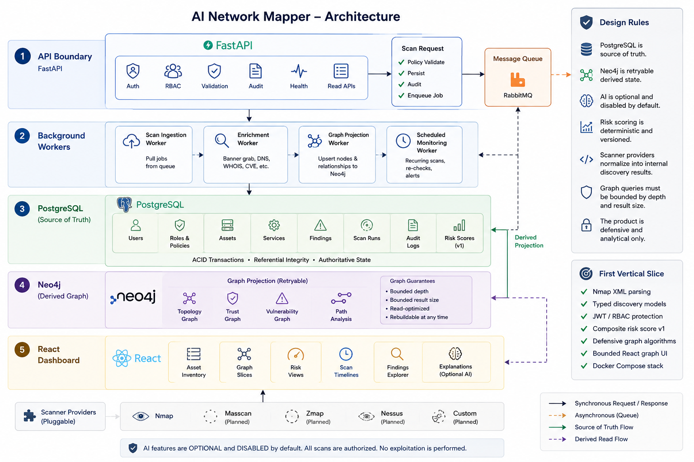
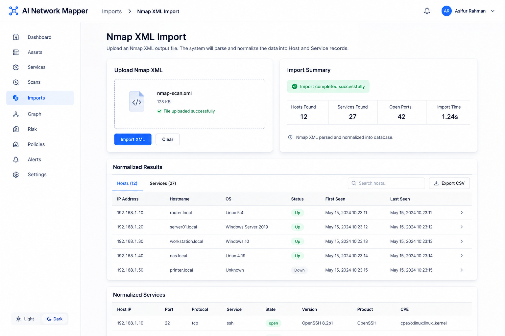
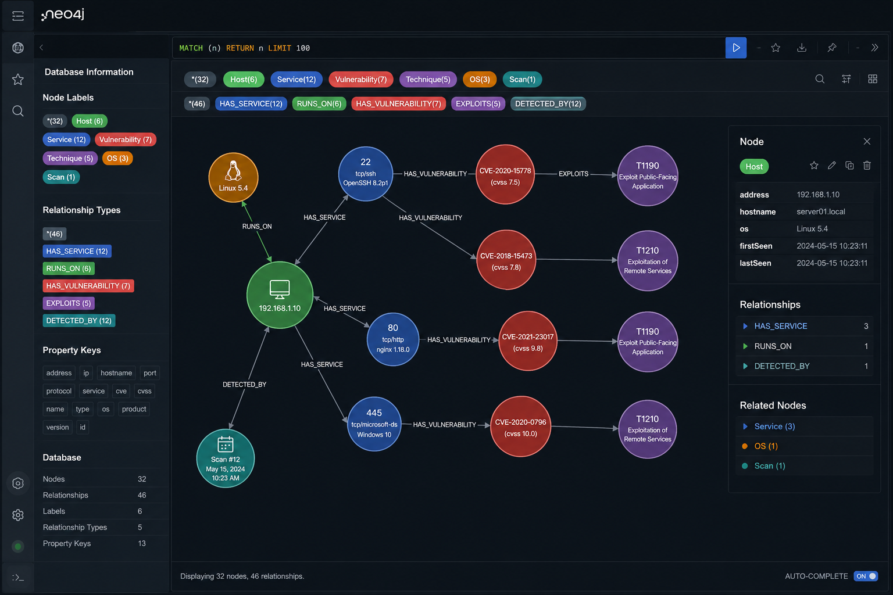
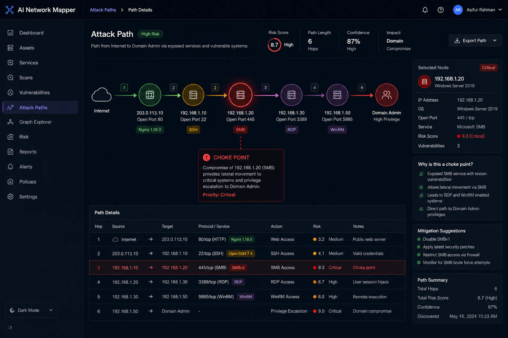

import Callout from '../../components/mdx/Callout.astro';


# Building SentinelAI: What I Learned Turning Nmap Scans Into a Defensive Attack-Path Engine
 
Most "AI security tool" projects on GitHub follow the same script: wrap an LLM around Nmap, call the output "AI-powered threat intelligence," ship a Streamlit dashboard, done. I didn't want to build that. I wanted to build something that answers a much harder question honestly: **if an attacker landed on any host in this network, what's the shortest path to something that actually matters — and can I prove it with evidence instead of vibes?**
 
That question is what became [SentinelAI](https://github.com/GeekyAsif786/sentinelAI) — a defensive network mapper and attack-path analysis platform. This post is the research write-up I promised myself I'd do once the core engine was working: the architecture decisions, the graph model, the risk scoring math, and a few mistakes I only caught by going back and reading my own code with a critical eye.
 
One boundary I set on day one and never crossed: **SentinelAI does not generate exploits, does not build payloads, and does not automate attacks.** Every feature in this project answers "where is the risk and why," never "how do I break in." That constraint shaped almost every architectural decision below.
 

 <br/>
---
 
## 1. The Core Idea: Two Databases, One Truth
 
The first design decision — and the one I'd defend hardest — is that SentinelAI runs on **two databases with strictly separated responsibilities**:
 
- **PostgreSQL is the system of record.** Every host, service, vulnerability, finding, scan run, and audit event lives here first. If PostgreSQL and Neo4j ever disagree, PostgreSQL wins.
- **Neo4j is a derived graph projection.** It exists purely to make traversal queries — "what's the path from this exposed service to the domain controller" — fast and expressive. It is never written to directly by the API.
This sounds obvious once you say it out loud, but it's the decision that saves you from an entire category of bugs: graph databases are fantastic at relationships and genuinely bad at being the single source of truth for structured, auditable records. I wanted the auditability of a relational schema and the traversal power of a graph, without pretending one tool could be great at both.
 
The rule is written directly into the architecture doc:
 
```text
- PostgreSQL is source of truth.
- Neo4j is retryable derived state.
- AI is optional and disabled by default.
- Risk scoring is deterministic and versioned.
- Scanner providers normalize into internal discovery results.
- Graph queries must be bounded by depth and result size.
- The product is defensive and analytical only.
```
 
That last line about bounded graph queries matters more than it looks. Unbounded Cypher traversals on a moderately sized inventory can blow up in query time and memory fast — I bound every visualization query by depth, node count, and relationship count from the start rather than discovering the problem in production.
 <br/>
---
 
## 2. Turning Nmap XML Into Typed Data
 
Everything starts with discovery. Right now that means Nmap, ingested through a `DiscoveryProvider` abstraction so I can add other scanners later without touching downstream code.
 
I didn't want to hardcode a single nmap flag set and call it a day. Different environments need different levels of aggression, so I built five scan profiles:
 
```python
class ScanProfile(StrEnum):
    local_discovery = "local_discovery"
    local_full = "local_full"
    external_discovery = "external_discovery"
    external_full = "external_full"
    external_stealth = "external_stealth"
 
SCAN_PROFILES: dict[ScanProfile, NmapScanConfig] = {
    ScanProfile.local_discovery: NmapScanConfig(
        profile=ScanProfile.local_discovery,
        flags=["-sn", "-PR", "--send-eth"],
        timing_template=4,
        max_rate=None,
        port_range="",
        description="ARP-based LAN host discovery",
    ),
    ScanProfile.external_stealth: NmapScanConfig(
        profile=ScanProfile.external_stealth,
        flags=["-sS", "--open"],
        timing_template=2,
        max_rate=150,
        port_range="1-65535",
        description="Slow stealth SYN scan, avoids IDS triggering",
    ),
    # ... local_full, external_discovery, external_full
}
```
 
The `local_*` profiles assume ARP-level access on a LAN. The `external_*` profiles rate-limit themselves and require root, because SYN scanning needs raw sockets. That distinction is enforced at execution time, not just documented:
 
```python
if profile in EXTERNAL_SCAN_PROFILES and getattr(os, "geteuid", lambda: 1)() != 0:
    raise PermissionError(
        f"Nmap profile {profile.value} requires root privileges for raw-socket and SYN scanning."
    )
```
 
Once nmap runs, its XML output goes through a strict parser rather than regex spaghetti. I only trust hosts explicitly marked `up`, only trust ports explicitly marked `open`, and I hash the raw artifact for audit purposes:
 
```python
def parse_artifact(self, artifact: str) -> DiscoveryResult:
    root = ElementTree.fromstring(artifact)
 
    scanner = root.attrib.get("scanner")
    if scanner != "nmap":
        raise NmapXmlParseError("XML artifact is not an Nmap result")
 
    hosts: list[DiscoveredHost] = []
    for host_element in root.findall("host"):
        status_element = host_element.find("status")
        if status_element is not None and status_element.attrib.get("state") != HOST_STATUS_UP:
            continue
        # ... extract IP, hostname, OS fingerprint, services
```
 
Every service extraction filters to `state == "open"` before it's allowed anywhere near the risk engine. A closed or filtered port never gets scored — this sounds like a small detail, but it's the difference between a risk report analysts trust and one they start ignoring after the third false positive.
 

 <br/>
---
 
## 3. Scope Enforcement Before a Single Packet Leaves the Box
 
This is the part of the project I'm actually proudest of, and it's the least glamorous. Before SentinelAI will scan *anything*, the target IP has to pass through a classifier that I wrote specifically to make "oops, I scanned something I shouldn't have" structurally hard to do.
 
```python
class ScanContext(StrEnum):
    institutional = "institutional"   # RFC1918 + cloud VPC + public
    external      = "external"        # public IPs only
    xml_import    = "xml_import"      # offline artifact, skip validation
 
_ALWAYS_BLOCKED: list[IPv4Network] = [
    ip_network("0.0.0.0/8"),          # unspecified
    ip_network("100.64.0.0/10"),      # RFC 6598 — CGNAT, never scannable
    ip_network("127.0.0.0/8"),        # loopback
    ip_network("169.254.0.0/16"),     # link-local
    ip_network("192.0.0.0/24"),       # IETF protocol assignments
    ip_network("192.0.2.0/24"),       # TEST-NET-1
    ip_network("198.18.0.0/15"),      # RFC 2544 benchmarking
    ip_network("198.51.100.0/24"),    # TEST-NET-2
    ip_network("203.0.113.0/24"),     # TEST-NET-3
    ip_network("224.0.0.0/4"),        # multicast
    ip_network("240.0.0.0/4"),        # reserved
    ip_network("255.255.255.255/32"), # broadcast
]
```
 
The list on its own isn't interesting — anyone can copy RFC 1918 and RFC 6598 ranges off Wikipedia. What's interesting is the *design constraint*: these blocks apply **regardless of scan context**. There is no admin flag, no override, no "trust me" parameter that lets a caller scan CGNAT space or a documentation-only TEST-NET range. If you want to scan something, it has to be a real, classifiable target — private RFC 1918 space for `institutional` engagements, public routable space for `external` engagements, or an already-captured offline artifact for `xml_import`.
 
```python
def is_valid_scan_target(ip: str, context: ScanContext = ScanContext.institutional) -> bool:
    if context == ScanContext.xml_import:
        try:
            ip_address(ip)
            return True
        except ValueError:
            return False
 
    if is_always_blocked(ip):
        return False
 
    if context == ScanContext.external and is_rfc1918(ip):
        return False
 
    return True
```
 
The reasoning here is first-principles: an active scanner is, by definition, a tool that sends packets to things you don't control. The failure mode isn't "the code has a bug" — it's "the operator fat-fingered a CIDR and now you're port-scanning someone else's production VPC or a shared CGNAT block full of unrelated ISP customers." Encoding the never-scan list as a hard, context-independent invariant means that failure mode requires an active decision to bypass the validator entirely, not a typo.
 <br/>
---
 
## 4. Composite Risk Scoring — Deterministic, Not Vibes-Based
 
I made an early decision to keep risk scoring **fully deterministic and versioned**, with AI explicitly kept out of the scoring loop. The score you see today should be reproducible a year from now given the same inputs, and I never want "the AI decided this was critical" to be an unfalsifiable answer during an audit.
 
```python
class CompositeRiskScore:
    version = "1.0.0"
    CVSS_WEIGHT = 0.45
    EPSS_WEIGHT = 0.25
    EXPOSURE_WEIGHT = 0.20
    ASSET_CRITICALITY_WEIGHT = 0.10
 
    def calculate(self, inputs: RiskInputs) -> RiskScore:
        cvss_component = self._bounded(inputs.cvss_score, 0.0, self.MAX_CVSS) / self.MAX_CVSS
        epss_component = self._bounded(inputs.epss_probability, 0.0, 1.0)
        exposure_component = self._exposure_component(inputs.exposure)
        asset_criticality_component = self._bounded(
            float(inputs.asset_criticality), 1.0, float(self.MAX_CRITICALITY)
        ) / float(self.MAX_CRITICALITY)
 
        score = round(
            100 * (
                cvss_component * self.CVSS_WEIGHT
                + epss_component * self.EPSS_WEIGHT
                + exposure_component * self.EXPOSURE_WEIGHT
                + asset_criticality_component * self.ASSET_CRITICALITY_WEIGHT
            ),
            2,
        )
        return RiskScore(score=score, severity=self._severity(score), scoring_version=self.version, ...)
```
 
Breaking that down to first principles: CVSS tells you *how bad* a vulnerability is in isolation. EPSS (Exploit Prediction Scoring System) tells you *how likely* it is to actually be exploited in the wild — a 9.8 CVSS bug nobody has ever weaponized is a very different risk than a 6.5 with a Metasploit module and active exploitation telemetry. I weight CVSS higher (0.45) because severity-of-outcome should dominate, but EPSS at 0.25 pulls the score toward reality instead of theoretical worst-case. Exposure (external vs internal vs unknown) and asset criticality round it out — a critical CVE on an internal dev box you don't care about should never outscore a medium CVE on an internet-facing production service.
 
One deliberate choice: missing CVSS or EPSS data is treated as **zero contribution**, not as a blocker. I didn't want the scoring pipeline to silently skip assets just because enrichment data hadn't arrived yet — partial data still produces a partial, honestly-labeled score.
 
Severity buckets fall out of the final number:
 
```python
def _severity(self, score: float) -> RiskSeverity:
    if score >= 85: return RiskSeverity.critical
    if score >= 70: return RiskSeverity.high
    if score >= 40: return RiskSeverity.medium
    if score >= 10: return RiskSeverity.low
    return RiskSeverity.informational
```
 
Every `RiskScore` object carries its `scoring_version` alongside the number. If I ever change the weights in v2, historical scores stay interpretable instead of silently drifting.
 <br/>
---
 
## 5. The Graph Model: What Neo4j Actually Stores
 
This is where the "network mapper" part becomes literal. PostgreSQL rows project into a Neo4j graph with a fixed set of node labels and relationship types, and the projection is intentionally conservative in its first version.
 
**Node labels:** `Host`, `Service`, `Vulnerability`, `Finding`, `NetworkSegment`, `AssetTag`, `Technique` — plus reserved-but-unimplemented labels (`User`, `Domain`, `Group`) for future Active Directory integration.
 
**Core relationships:**
 
```text
(:Host)-[:RUNS]->(:Service)
(:Service)-[:HAS_VULNERABILITY]->(:Vulnerability)
(:Host)-[:HAS_FINDING]->(:Finding)
(:Finding)-[:REFERENCES]->(:Vulnerability)
(:Host)-[:MEMBER_OF]->(:NetworkSegment)
(:Host)-[:TAGGED_AS]->(:AssetTag)
(:Host)-[:CONNECTS_TO]->(:Host)
(:Finding)-[:MAPS_TO]->(:Technique)
```
 
Two rules govern every write into this graph, and they came directly out of thinking hard about what "derived state" actually means in practice:
 
**Idempotency.** Nodes are merged by stable ID, relationships are merged by `(source, target, type, context_id)`. Re-running a projection job should never duplicate a node or an edge — a naive `CREATE` on every projection run would turn the graph into an unusable mess after the third re-scan of the same host.
 
**Staleness over deletion.** If a service closes or a finding resolves, the graph marks it stale instead of deleting it immediately. Historical path comparison ("was this host reachable from the DMZ last month?") only works if you don't destroy history the moment something changes state. Active views filter to current/open by default, but the history is still there if you need it.
 
The projection job runs as a Celery task, queued the moment a scan completes:
 
```python
def _trigger_graph_projection(session, scan_run: ScanRun) -> None:
    projection_job = GraphProjectionJob(scan_run_id=scan_run.id)
    session.add(projection_job)
    session.commit()
    project_inventory_graph.delay(scan_run_id=str(scan_run.id))
```
 
And if projection fails? PostgreSQL inventory stays authoritative and correct — the API just marks graph endpoints as potentially stale rather than silently serving outdated topology as if it were current.
 

 <br/>
---
 
## 6. The Attack Path Engine — Where It Gets Fun
 
This is the centerpiece. Given a graph of hosts, services, and weighted relationships, the engine answers three questions:
 
1. What's the shortest path (by hop count) from A to B?
2. What's the lowest-cost path (by risk-weighted edges) from A to B?
3. Where are the choke points — nodes an attacker would have to pass through no matter which way they moved?
BFS for the unweighted case:
 
```python
def shortest_path_bfs(self, source: str, target: str) -> PathResult | None:
    queue: deque[tuple[str, tuple[str, ...], float]] = deque([(source, (source,), 1.0)])
    visited: set[str] = {source}
 
    while queue:
        node, path, confidence = queue.popleft()
        for relationship in self._adjacency.get(node, []):
            if relationship.target in visited:
                continue
            next_path = (*path, relationship.target)
            next_confidence = min(confidence, relationship.confidence)
            if relationship.target == target:
                return PathResult(
                    path=next_path,
                    total_weight=float(len(next_path) - 1),
                    confidence=next_confidence,
                    critical_nodes=self.critical_nodes(next_path),
                )
            visited.add(relationship.target)
            queue.append((relationship.target, next_path, next_confidence))
    return None
```
 
Notice `confidence` is threaded through the whole traversal as a running minimum, not an afterthought bolted on at the end. Every relationship in the graph carries a confidence value — an `RUNS` edge sourced directly from a live scan is high-confidence; an inferred `CONNECTS_TO` edge based on routing data is lower. A path's overall confidence is only as strong as its weakest link, which is exactly how a human analyst should read it: *"I'm 72% confident this path exists"* is a materially different statement from *"this path exists."*
 
For risk-weighted traversal, I used a Dijkstra-style priority queue where edge weight comes from the cost model — service exposure, finding risk score, EPSS probability, asset criticality, and tags like `Production`, `PCI`, or `DomainController` all feed into "how easy or concerning is this hop":
 
```python
def lowest_cost_path(self, source: str, target: str) -> PathResult | None:
    queue: list[tuple[float, str, tuple[str, ...], float]] = [(0.0, source, (source,), 1.0)]
    best_costs: dict[str, float] = {source: 0.0}
 
    while queue:
        cost, node, path, confidence = heappop(queue)
        if node == target:
            return PathResult(path=path, total_weight=round(cost, 4), confidence=confidence,
                               critical_nodes=self.critical_nodes(path))
        for relationship in self._adjacency.get(node, []):
            next_cost = cost + relationship.weight
            if next_cost >= best_costs.get(relationship.target, float("inf")):
                continue
            best_costs[relationship.target] = next_cost
            heappush(queue, (next_cost, relationship.target, (*path, relationship.target),
                              min(confidence, relationship.confidence)))
    return None
```
 
And choke points — nodes with at least two inbound *and* two outbound relationships, meaning they sit on multiple routes rather than a single one:
 
```python
def choke_points(self) -> tuple[str, ...]:
    incoming: dict[str, int] = defaultdict(int)
    outgoing: dict[str, int] = defaultdict(int)
    for relationship in self._relationships:
        outgoing[relationship.source] += 1
        incoming[relationship.target] += 1
    return tuple(sorted(
        node for node in set(incoming) | set(outgoing)
        if incoming[node] >= 2 and outgoing[node] >= 2
    ))
```
 
In practice, this is the query that tends to matter most for defenders: not "what's the single worst path" but "what's the one host that, if I isolated it tomorrow, would break the most attack paths at once." A jump box or an over-permissioned bastion host almost always shows up here, and seeing it surface algorithmically rather than by gut feeling is a genuinely useful sanity check.
 
Failure handling is explicit rather than implicit: empty graphs return no path, disconnected graphs return no path, and cycles are bounded by the `visited` set so a loop in `CONNECTS_TO` relationships can't spin the traversal forever.
 

 <br/>
---
 
## 7. Mapping Findings to MITRE ATT&CK
 
Every finding gets an optional mapping to ATT&CK techniques, again with a confidence score attached rather than a binary yes/no:
 
```python
class MitreAttackMapper:
    def map_finding(self, finding_type: FindingType, service_name: str | None, title: str) -> tuple[MitreMapping, ...]:
        normalized_service = (service_name or "").lower()
        mappings: list[MitreMapping] = []
 
        if normalized_service in {"smb", "microsoft-ds", "netbios-ssn"}:
            mappings.append(MitreMapping(
                tactic="Lateral Movement",
                technique_id="T1021.002",
                technique_name="SMB/Windows Admin Shares",
                confidence=0.72,
                evidence="SMB exposure can support lateral movement analysis when trust context exists.",
            ))
 
        if finding_type == FindingType.weak_auth or "weak authentication" in title.lower():
            mappings.append(MitreMapping(
                tactic="Credential Access", technique_id="T1110", technique_name="Brute Force",
                confidence=0.68,
                evidence="Weak authentication finding indicates credential-access risk.",
            ))
 
        if normalized_service in {"ssh", "rdp", "ms-wbt-server"}:
            mappings.append(MitreMapping(
                tactic="Lateral Movement", technique_id="T1021", technique_name="Remote Services",
                confidence=0.64,
                evidence="Remote administration service is exposed and should be reviewed defensively.",
            ))
 
        return tuple(mappings)
```
 
It's a rule-based mapper right now, not a model — which was a deliberate call. ATT&CK mapping is exactly the kind of thing where a plausible-sounding but wrong LLM guess is worse than no mapping at all, because analysts tend to trust structured-looking output more than they should. Rules with explicit evidence strings are slower to extend but never lie about their reasoning.
 <br/>
---
 
## 8. AI Is Optional, Disabled by Default, and Never the Authority
 
This is the design choice I feel most strongly about. There's an `AISecurityAnalyst` abstraction in the codebase, and its default implementation does nothing generative at all:
 
```python
class DisabledAISecurityAnalyst(AISecurityAnalyst):
    def explain(self, request: SecurityAnalysisRequest) -> SecurityAnalysisResponse:
        evidence_keys = ", ".join(sorted(request.evidence.keys())) or "no evidence fields"
        generated_text = (
            f"AI analysis is disabled. Deterministic evidence for {request.subject_type} "
            f"{request.subject_id} includes: {evidence_keys}. Review risk score, asset exposure, "
            "and MITRE mappings before making security decisions."
        )
        return SecurityAnalysisResponse(
            provider="disabled", model="deterministic-template",
            prompt_version="defensive-explanation-v1",
            generated_text=generated_text, is_ai_generated=False,
            source_evidence=request.evidence,
        )
```
 
`AI_ENABLED=false` is the default in every environment file, including the Docker Compose stack. When AI *is* turned on, the response schema still carries `is_ai_generated: bool` and the underlying deterministic evidence alongside whatever the model produced — so a generated explanation is always traceable back to the numbers that justified it, and can never silently replace the score itself. The AI explains; it doesn't decide.
 <br/>
---
 
## 9. Full Stack, Observability Included
 
The Docker Compose stack tells you almost everything about the runtime shape of the project:
 
```yaml
services:
  api:        # FastAPI — auth, RBAC, validation, audit, read APIs
  worker:     # Celery worker — celery -A app.worker.celery_app worker
  frontend:   # React + TypeScript + Vite dashboard
  postgres:   # postgres:16 — system of record
  neo4j:      # neo4j:5 — derived graph projection
  redis:      # redis:7 — Celery broker + result backend
  prometheus: # prom/prometheus:v2.54.1
  grafana:    # grafana/grafana:11.1.4
```
 
The API process never shells out to `nmap` directly — scan requests are policy-validated and persisted first, then queued for a worker to actually execute. That separation means a compromised or buggy API request handler can't turn into arbitrary scanner execution; the worker is the only thing with the privilege and binary access to run `nmap`, and it only acts on rows that already passed policy and target validation.
<br/>
---
 
## 10. A Mistake I Caught Going Back Through My Own Repo
 
I want to be honest about this one instead of pretending the research process was clean. Writing this article meant re-reading my own `docker-compose.yml` line by line, and I found a **hardcoded third-party API key sitting in plaintext** as an environment default for local development. It's a low-privilege enrichment API key, not a credential to anything customer-facing or production, but "low-privilege" isn't the same as "fine to commit." My own roadmap doc literally lists *"no secrets are committed"* as a Phase 0 acceptance criterion, and I violated it in the exact file meant to demonstrate local dev hygiene.
 
I'm rotating that key and moving it to `.env.example` with a placeholder before this goes live. I'm including this in the write-up on purpose — a "deep research" post that only shows the parts that worked isn't research, it's a highlight reel. The target validator and the AI-disabled-by-default pattern exist because I designed for failure modes up front. This one is a reminder that documentation intent and actual committed files can drift, and the only fix is periodically reading your own repo like an outsider would.
 <br/>
---
 
## What's Next
 
The current milestone gets me a working vertical slice: Nmap ingestion, deterministic risk scoring, graph projection, attack-path queries, MITRE mapping, and a bounded React dashboard — all defensive, all auditable. The next phases on the roadmap add scan policy governance UI, EPSS/CVE enrichment pipelines wired fully end-to-end, and the reserved Active Directory node types (`User`, `Domain`, `Group`, relationships like `ADMIN_TO` and `HAS_SESSION`) once there's a real identity data source to back them — not before, because a graph full of speculative AD relationships with no evidence behind them is worse than no AD graph at all.
 
If you want to poke at the code, the repo is here: **[github.com/GeekyAsif786/sentinelAI](https://github.com/GeekyAsif786/sentinelAI)**. Issues and PRs against the defensive scope are welcome; PRs that add exploitation or payload-generation features will get closed, on principle.
<br/> 
---


